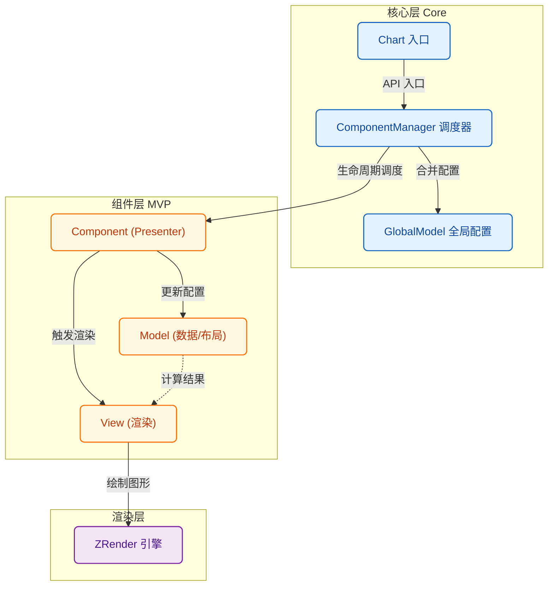
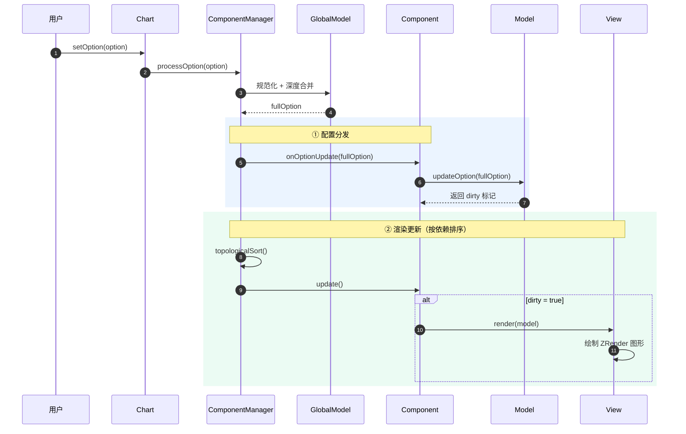

# 贡献指南 (Contributing Guide)

感谢你对 **Signal Chart** 感兴趣！我们非常欢迎社区的贡献，无论是新功能的开发、BUG 修复还是文档改进。

这份文档将帮助你理解项目架构，并指导你如何扩展新的图表组件。

## 🏗 项目架构 (Architecture)

Signal Chart 采用了 **MVP (Model-View-Presenter)** 架构的变体，通过 `ComponentManager` 协调全局状态。

### 核心模块

1.  **Core**:
    - `Chart`: 对外暴露的 API 入口，单例管理。
    - `ComponentManager`: 核心调度器。负责组件注册、依赖注入、配置合并、更新通知和渲染循环。
    - `GlobalModel`: 维护全局配置状态 (Global Option Source of Truth)。

2.  **Utils**:
    - `config.ts`: 深度合并配置，支持数组智能合并。
    - `normalize.ts`: 配置标准化。

### 架构概览 (Architecture Diagram)



### 数据流向 (Data Flow)



## 🧩 组件系统 (Component System)

每个组件（如 Axis, Grid）都由三部分组成：

1.  **Component (Presenter)**: 继承自 `BaseComponent`。负责连接 Model 和 View，处理生命周期。
2.  **Model**: 继承自 `ComponentModel`。负责数据处理、布局计算。**纯逻辑，无渲染依赖**。
3.  **View**: 继承自 `ComponentView`。负责根据 Model 数据绘制图形。**纯渲染，无业务逻辑**。

### 如何开发新组件？

假设我们要开发一个 `Legend` 组件。

#### 1. 定义配置接口

在 `src/types/core.ts` 扩展类型：

```typescript
export interface LegendOption {
  show?: boolean
  left?: number | string
  // ...
}

export interface ChartOption {
  legend?: LegendOption | LegendOption[]
}
```

#### 2. 创建 Model

```typescript
// src/model/LegendModel.ts
export class LegendModel extends ComponentModel<LegendOption[]> {
  protected extractOption(globalOption: ChartOption): LegendOption[] {
    return globalOption.legend || []
  }
}
```

#### 3. 创建 View

```typescript
// src/view/LegendView.ts
export class LegendView extends ComponentView<LegendModel> {
  public render(model: LegendModel): void {
    this.clear()
    const options = model.getOption()
    options.forEach(opt => {
        // 使用 zrender 绘图
        const rect = new Rect({ ... })
        this.group.add(rect)
    })
  }
}
```

#### 4. 创建 Component

```typescript
// src/component/LegendComponent.ts
export class LegendComponent extends BaseComponent {
  type = ComponentType.Legend
  // 如果依赖其他组件，在此声明
  // static dependencies = [ComponentType.Grid]

  constructor(context: ComponentContext) {
    super(context)
    this.model = new LegendModel(context)
    this.view = new LegendView(context.chart.getZr())
  }
}
```

#### 5. 注册

```typescript
// src/main.ts
Chart.use(LegendComponent)
```

## 🛠 开发环境

1.  **环境准备**: Node.js >= 16, pnpm (推荐) 或 npm。
2.  **启动**: `npm run dev`
3.  **提交代码**: 请确保代码风格统一，关键逻辑包含注释。

## 🤝 参与贡献

1.  Fork 本仓库。
2.  创建特性分支 (`git checkout -b feat/new-component`)。
3.  提交更改。
4.  发起 Pull Request。
