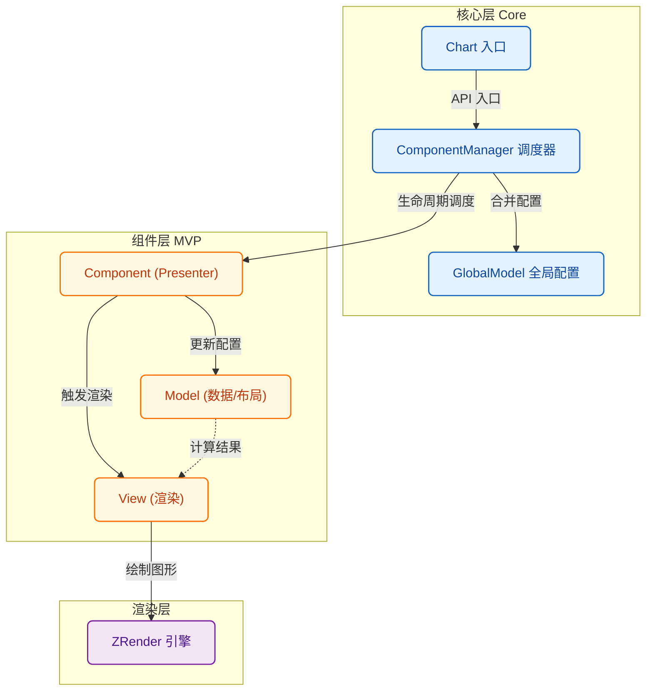
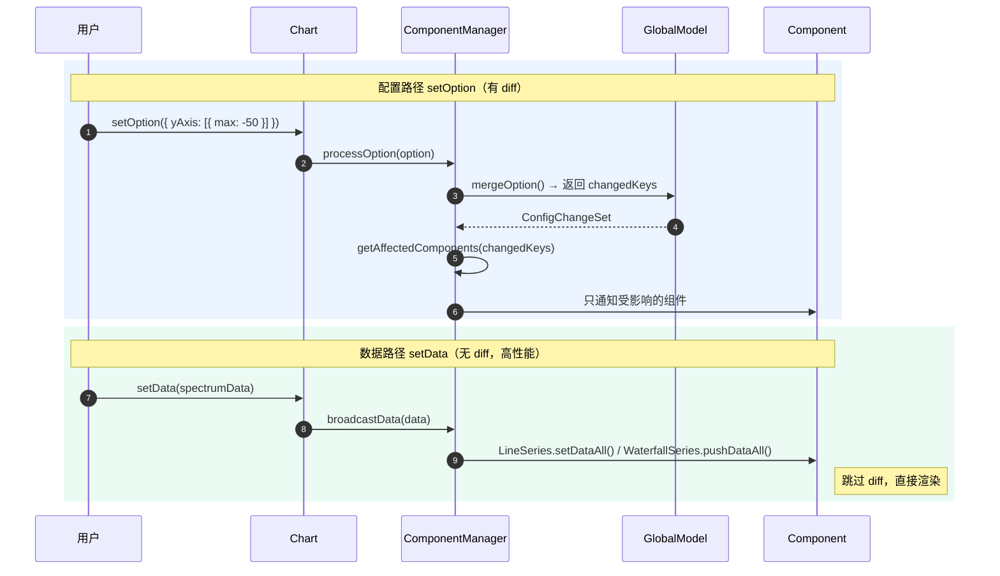

# 贡献指南 (Contributing Guide)

感谢你对 **Signal Chart** 感兴趣！我们非常欢迎社区的贡献，无论是新功能的开发、BUG 修复还是文档改进。

这份文档将帮助你理解项目架构，并指导你如何扩展新的图表组件。

## 🏗 项目架构 (Architecture)

Signal Chart 采用了 **MVP (Model-View-Presenter)** 架构的变体，通过 `ComponentManager` 协调全局状态。专为高性能实时信号可视化设计。

### 核心模块

1.  **Core**:
    - `Chart`: 对外暴露的 API 入口，单例管理。
    - `ComponentManager`: 核心调度器。负责组件注册、依赖注入、配置合并、精准通知和渲染循环。
    - `GlobalModel`: 维护全局配置状态，支持分层 diff。

2.  **Utils**:
    - `config.ts`: 深度合并配置，支持数组智能合并，`deepEqual` 深度比较。
    - `normalize.ts`: 配置标准化。
    - `scale.ts`: D3 封装的比例尺工具（`linearMap`, `batchLinearMap`, `createColorScale`）。

### 架构概览 (Architecture Diagram)



### 双数据路径 (Two Data Paths)

Signal Chart 区分**配置更新**和**数据更新**两条路径，以实现最佳性能：



### Diff 策略

**setOption（配置变更）：**
1. 只比较用户传入的字段
2. 快速引用比较 → 不同才深度比较
3. 返回 `ConfigChangeSet`（变更的配置键集合）
4. 根据映射表只通知受影响的组件
5. 依赖传播：Grid 变化 → Axis → Series

**setData（实时数据）：**
- 完全跳过 diff，直接更新渲染
- LineSeries：替换当前帧数据
- WaterfallSeries：追加到 RingBuffer

## 🧩 组件系统 (Component System)

每个组件（如 Axis, Grid, LineSeries）都由三部分组成：

1.  **Component (Presenter)**: 继承自 `BaseComponent`。负责连接 Model 和 View，处理生命周期。
2.  **Model**: 继承自 `ComponentModel`。负责数据处理、布局计算。**纯逻辑，无渲染依赖**。
3.  **View**: 继承自 `ComponentView`。负责根据 Model 数据绘制图形。**纯渲染，无业务逻辑**。

### 现有组件

| 组件 | 说明 | 特性 |
|------|------|------|
| **GridComponent** | 网格区域 | 计算绑定区域 |
| **XAxisComponent** | X 轴 | 依赖 Grid |
| **YAxisComponent** | Y 轴 | 依赖 Grid |
| **LineSeriesComponent** | 折线图/频谱图 | 对象池复用、批量坐标转换、ClipRect |
| **WaterfallSeriesComponent** | 瀑布图 | RingBuffer、离屏 Canvas、D3 颜色映射、色卡 |

### 如何开发新组件？

假设我们要开发一个 `Legend` 组件。

#### 1. 定义配置接口

在 `src/types/core.ts` 扩展类型：

```typescript
export interface LegendOption {
  show?: boolean
  left?: number | string
  // ...
}

export interface ChartOption {
  legend?: LegendOption[]
}
```

#### 2. 添加组件类型

在 `src/types/component.ts` 添加枚举：

```typescript
export enum ComponentType {
  // ...existing
  Legend = "legend"
}
```

#### 3. 创建 Model

```typescript
// src/model/LegendModel.ts
export class LegendModel extends ComponentModel<LegendOption[]> {
  protected extractOption(globalOption: ChartOption): LegendOption[] {
    return globalOption.legend || []
  }
  // shouldUpdate 使用父类的 deepEqual 实现，无需重写
}
```

#### 4. 创建 View

```typescript
// src/view/LegendView.ts
export class LegendView extends ComponentView<LegendRenderItem[]> {
  // 对象池（性能优化）
  private elementPool: Rect[] = []

  public render(items: LegendRenderItem[]): void {
    // 复用或创建图形对象
    items.forEach((item, i) => {
      if (i < this.elementPool.length) {
        // 复用已有对象
        this.elementPool[i].setShape({ ... })
        this.elementPool[i].show()
      } else {
        // 创建新对象
        const rect = new Rect({ ... })
        this.elementPool.push(rect)
        this.group.add(rect)
      }
    })
    // 隐藏多余对象
    for (let i = items.length; i < this.elementPool.length; i++) {
      this.elementPool[i].hide()
    }
  }
}
```

#### 5. 创建 Component

```typescript
// src/component/LegendComponent.ts
export class LegendComponent extends BaseComponent {
  type = ComponentType.Legend
  // 如果依赖其他组件，在此声明
  static dependencies = [ComponentType.LineSeries]

  private model: LegendModel
  private view: LegendView

  constructor(context: ComponentContext) {
    super(context)
    this.model = new LegendModel({
      containerWidth: this.chart.getWidth(),
      containerHeight: this.chart.getHeight()
    })
    this.view = new LegendView(this.chart.getZr())
  }

  onDependenciesReady(deps: Map<ComponentType, ComponentInstance>): void {
    // 获取依赖的组件
  }

  protected getModel(): LegendModel {
    return this.model
  }
}
```

#### 6. 更新 ComponentManager 映射

在 `src/core/ComponentManage.ts` 添加配置映射：

```typescript
const CONFIG_TO_COMPONENT: Record<string, ComponentType[]> = {
  // ...existing
  legend: [ComponentType.Legend]
}
```

#### 7. 注册

```typescript
// src/main.ts
Chart.use(LegendComponent)
```

## 🚀 性能优化指南

开发新组件时，请遵循以下性能最佳实践：

1. **对象池复用**：不要每帧创建/销毁 ZRender 对象，使用对象池复用
2. **批量操作**：使用 `batchLinearMap` 批量坐标转换，避免逐点调用
3. **ClipRect**：使用 `setClipPath` 进行 GPU 裁剪，避免逐点边界检查
4. **避免 toDataURL**：直接使用 Canvas 元素作为 Image 源
5. **RingBuffer**：滚动数据使用环形缓冲区，避免数组 shift 操作

## 🛠 开发环境

1.  **环境准备**: Node.js >= 16, pnpm (推荐) 或 npm。
2.  **启动**: `pnpm dev`
3.  **类型检查**: `pnpm type-check`
4.  **测试**: `pnpm test`
5.  **提交代码**: 请确保代码风格统一，关键逻辑包含注释。

## 🤝 参与贡献

1.  Fork 本仓库。
2.  创建特性分支 (`git checkout -b feat/new-component`)。
3.  提交更改。
4.  发起 Pull Request。
