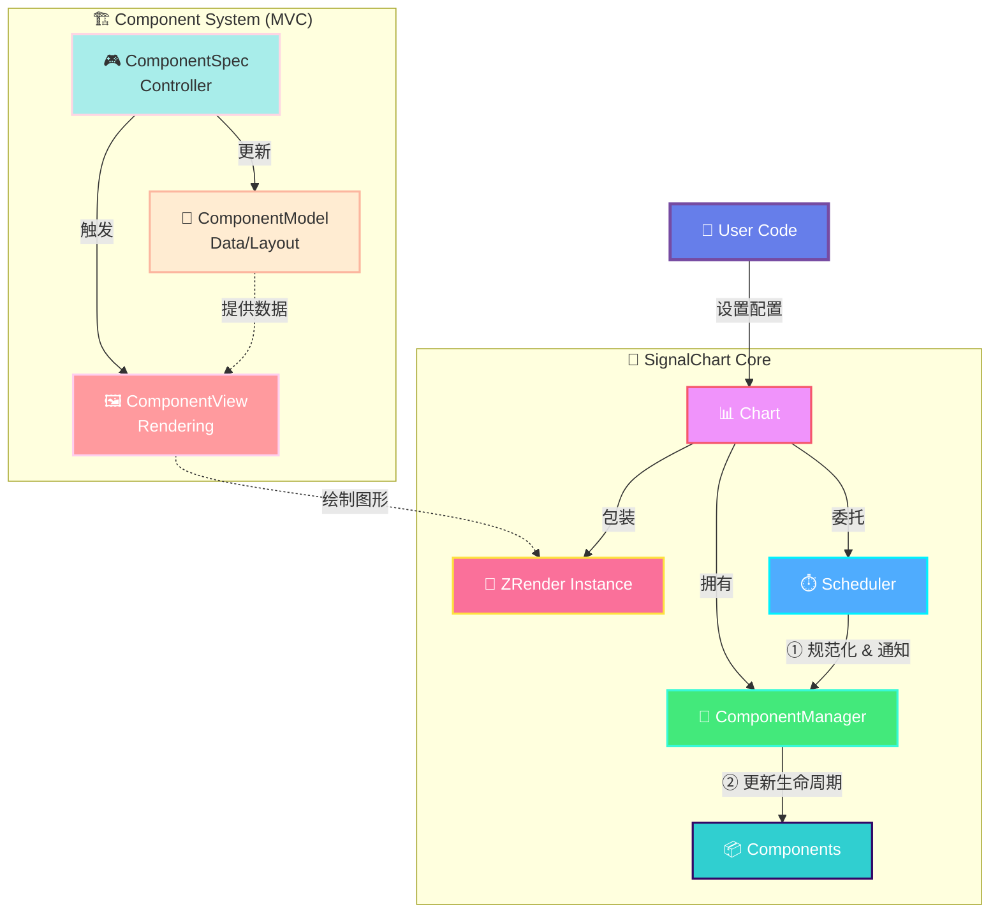
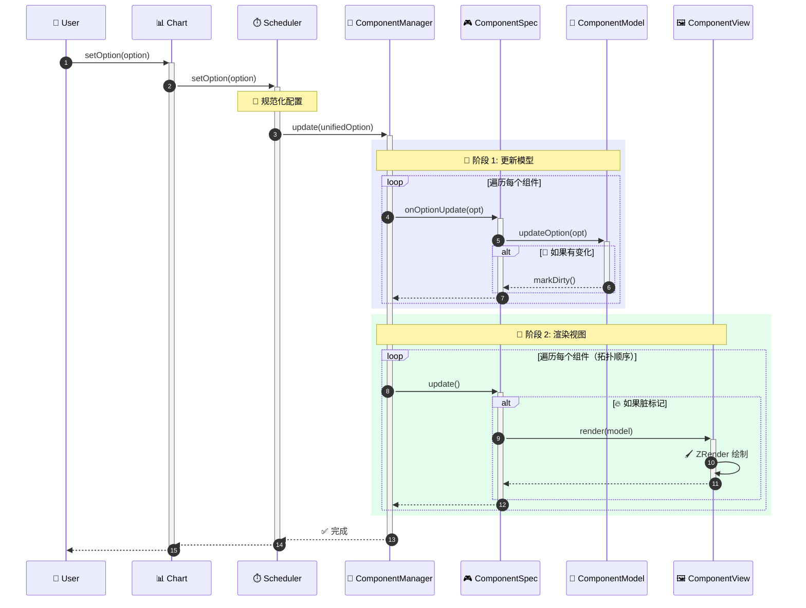

# 贡献指南 (Contributing Guide)

感谢你对 **Signal Chart** 感兴趣！这是一个基于 ZRender 的高性能、可扩展的频谱可视化库。我们非常欢迎社区的贡献，无论是新功能的开发、BUG 修复还是文档改进。

这份文档将帮助你理解项目架构，并指导你如何扩展新的图表组件。

## 🏗 项目架构 (Architecture)

Signal Chart 采用了配置驱动（Option-Driven）和组件化（Component-Based）的架构设计，核心思想类似于 ECharts，但针对音频信号场景进行了简化和优化。



### 核心模块

1.  **Chart (核心入口)**:
    - 负责管理 ZRender 实例、DOM 容器和生命周期。
    - 维护全局组件注册表 (`Chart.use`)。
    - 单例管理模式 (`getInstanceByDom`)。

2.  **Scheduler (调度器)**:
    - 负责接收用户配置 (`setOption`)。
    - **规范化 (Normalize)**: 将用户输入的松散配置转换为内部标准的配置格式。
    - **通知 (Notify)**: 将最新的配置分发给所有注册的组件。
    - **协调 (Flush)**: 触发组件更新。

### 数据流向 (Data Flow)

以下是 `setOption` 触发更新的完整流程：



### 组件架构 (Model-View Pattern)

为了保持逻辑清晰和可测试性，所有的组件（Component）都遵循 **Model-View** 分离的设计模式：

- **BaseComponent (Controller)**:
  - 组件的入口类，继承自 `BaseComponent`。
  - 负责协调 Model 和 View。
  - 管理 `dirty` 状态，避免不必要的重绘。
  - **依赖声明**: 通过静态属性 `dependencies` 声明组件依赖。
  - **依赖注入**: 通过 `onDependenciesReady` 钩子自动接收依赖的组件实例。

- **ComponentModel (Model)**:
  - 继承自 `ComponentModel<T>`。
  - **职责**: 解析配置、合并默认值、计算布局数据（如 x, y, width, height）、提供坐标转换方法。
  - **纯逻辑**: 不包含任何 ZRender 绘图代码。
  - **易测试**: 可以独立进行单元测试，不依赖渲染环境。

- **ComponentView (View)**:
  - 继承自 `ComponentView<M>`。
  - **职责**: 根据 Model 提供的数据，使用 ZRender 图形元素进行绘制。
  - **纯渲染**: 不处理业务逻辑或配置解析。
  - **可替换**: 支持切换不同的渲染引擎。

### 组件依赖管理

Signal Chart 提供了**声明式依赖注入**机制，组件可以声明自己需要的依赖，由 ComponentManager 自动注入：

```typescript
// 示例：Axis 组件依赖 Grid 组件
export class XAxisComponent extends BaseComponent {
  // 1. 声明依赖
  static dependencies = [ComponentType.Grid]

  private gridComponent: GridComponent | null = null

  // 2. 依赖注入钩子
  onDependenciesReady(dependencies: Map<ComponentType, BaseComponent>): void {
    this.gridComponent = dependencies.get(ComponentType.Grid) as GridComponent
  }

  // 3. 使用依赖
  update() {
    if (this.gridComponent) {
      this.model.setGridModel(this.gridComponent.getModel())
    }
    this.view.render(this.model)
  }
}
```

**优势**:

- ✅ **类型安全**: 无需 `as any` 类型断言
- ✅ **自动管理**: ComponentManager 自动解析和注入依赖
- ✅ **易扩展**: 新增组件只需声明依赖，无需修改 ComponentManager
- ✅ **清晰表达**: 组件依赖关系一目了然

---

## 🚀 如何开发新组件 (Extending Guide)

如果你想添加一个新的图表组件（例如一个新的 Series 类型或图例组件），请遵循以下步骤。

### 1. 定义配置接口

在 `src/core/type.ts` 中定义你的组件配置接口：

```typescript
// src/core/type.ts
export interface MyComponentOption {
  show?: boolean
  color?: string
  // ...其他配置
}

// 扩展主配置接口
export interface ChartOption {
  // ...
  myComponent?: MyComponentOption
}
```

### 2. 创建 Model

新建 `src/model/myComponentModel.ts`。Model 负责处理数据逻辑。

```typescript
import { ComponentModel } from "./baseModel"
import { ChartOption } from "@/core/type"

export class MyComponentModel extends ComponentModel<MyComponentOption> {
  // 1. 定义默认配置
  protected getDefaultOption(): MyComponentOption {
    return {
      show: true,
      color: "#000"
    }
  }

  // 2. 提取配置
  protected extractOption(globalOption: ChartOption): MyComponentOption | undefined {
    return globalOption.myComponent
  }

  // 3. (可选) 实现具体的计算逻辑
  public calculateLayout() {
    // 使用 this.context.containerWidth 等计算
  }
}
```

### 3. 创建 View

新建 `src/view/myComponentView.ts`。View 负责绘图。

```typescript
import { ComponentView } from "./baseView"
import { MyComponentModel } from "@/model/myComponentModel"
import { Circle } from "zrender"

export class MyComponentView extends ComponentView<MyComponentModel> {
  public render(model: MyComponentModel): void {
    // 1. 清理旧图形（baseView 已实现基础清理）
    this.clear()

    const option = model.getOption()
    if (!option.show) return

    // 2. 绘制图形
    const circle = new Circle({
      shape: { cx: 100, cy: 100, r: 50 },
      style: { fill: option.color }
    })

    // 3. 添加到组
    this.group.add(circle)
  }
}
```

### 4. 创建 Component 入口

新建 `src/component/myComponent.ts`。

```typescript
import { BaseComponent, ComponentType, ComponentContext } from "./baseComponent"
import { MyComponentModel } from "@/model/myComponentModel"
import { MyComponentView } from "@/view/myComponentView"
import { ChartOption } from "@/core/type"

export class MyComponent extends BaseComponent {
  type = ComponentType.MyComponent // 需要在 ComponentType 枚举中添加

  // 如果组件有依赖，在这里声明
  // static dependencies = [ComponentType.Grid]

  private model: MyComponentModel
  private view: MyComponentView

  constructor(context: ComponentContext) {
    super(context)
    const width = this.zr.getWidth() || 800
    const height = this.zr.getHeight() || 600

    this.model = new MyComponentModel({ containerWidth: width, containerHeight: height })
    this.view = new MyComponentView(this.zr)
  }

  // 如果声明了依赖，实现此钩子
  // onDependenciesReady(dependencies: Map<ComponentType, BaseComponent>): void {
  //   this.gridComponent = dependencies.get(ComponentType.Grid) as GridComponent
  // }

  init() {
    this.view.init()
    this.dirty = false
  }

  onOptionUpdate(option: ChartOption) {
    this.model.updateOption(option)
    if (this.model.dirty) {
      this.dirty = true
      this.model.dirty = false // 重置 model 状态
    }
  }

  update() {
    if (!this.dirty) return
    this.view.render(this.model)
    this.dirty = false
  }

  clear() {
    this.view.clear()
  }
  destroy() {
    this.view.destroy()
  }
}
```

### 5. 注册组件

在使用时注册你的新组件：

```typescript
Chart.use(MyComponent)
```

---

## 🛠 开发环境设置

1.  **安装依赖**:

    ```bash
    npm install
    ```

2.  **启动开发服务器**:

    ```bash
    npm run dev
    ```

3.  **代码提交规范**:
    - 请确保代码通过 TypeScript 检查。
    - 遵循现有的代码风格（Model/View 分离）。
    - 提交信息清晰明了（例如：`feat: add waterfall series component`）。

---

## 💡 核心工具函数

- **`src/utils/coordinate.ts`**:
  - `linearMap`: 线性映射，用于将数据值转换为像素坐标。
  - `parsePercent`: 解析 "50%" 或数值。
  - `calculateRect`: 计算容器内的矩形布局。

- **`src/utils/format.ts`**:
  - `calculateNiceTicks`: 生成美观的坐标轴刻度。

## 🤝 提交 Pull Request

1.  Fork 本仓库。
2.  创建一个新的分支 (`git checkout -b feature/AmazingFeature`)。
3.  提交你的更改 (`git commit -m 'Add some AmazingFeature'`)。
4.  推送到分支 (`git push origin feature/AmazingFeature`)。
5.  打开一个 Pull Request。
